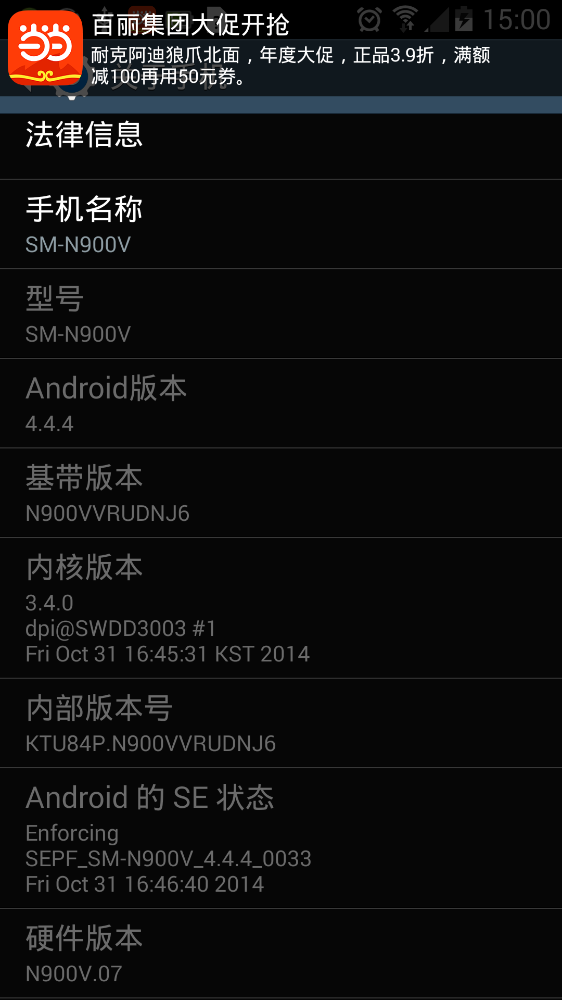
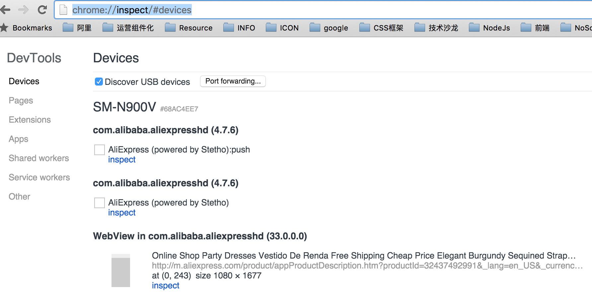
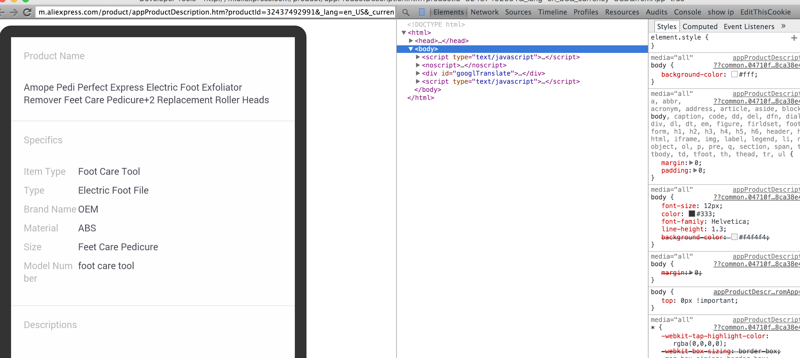

### SM-900V Note3升级4.4.4

型号：Note3美版(SM-900v)

Android：4.4.4

基带版本：N900VVRUDNJ6

4.3无法调试APP里面内嵌的WebView页面，同时4.3版本耗电较大，升级的ROM是官方原版ROM

手机通讯录通过360备份，手机备份用SmartFinder for Android锤子出品，MAC底下安卓用户的福音。

APP备份软件(备份和回复)
刷机之后可以用豌豆荚应用安装器，将应用直接安卓回手机。

目前唯一不爽的是无法ROOT

### 升级步骤
- 准备软件
大概用到Odin、官方ROM包，基于线刷模式，知道怎么进入挖煤模式
Note3挖煤模式进入方法：音量上+HOME+电源键，手机震动后松开，这个时候会看到一个类似这个画面说明成功了。

[刷机教程](http://zm8.sm.cn/?src=http%3A%2F%2Fwww.shuaji.net%2From%2Fsamsung%2FN7100_Note2%2FN7100_Note2shuajijiaocheng%2F2013051417002.html&uid=8815064c200484aed54ccdea384eafcf&restype=1&from=derive&depth=5&pi=&businesstype=&link_type=60&wap=false)

- 软件清单

[Odin](http://pan.baidu.com/s/1kUkvmXT)

[Rom包](http://pan.baidu.com/s/1eQTA8wi)

按照刷机教程里面的线刷模式，选择一体包，刷完后自动重启大概5分钟左右。

### 真机调试

- 进入设备界面

chrome://inspect/#devices

- 点击inspect

