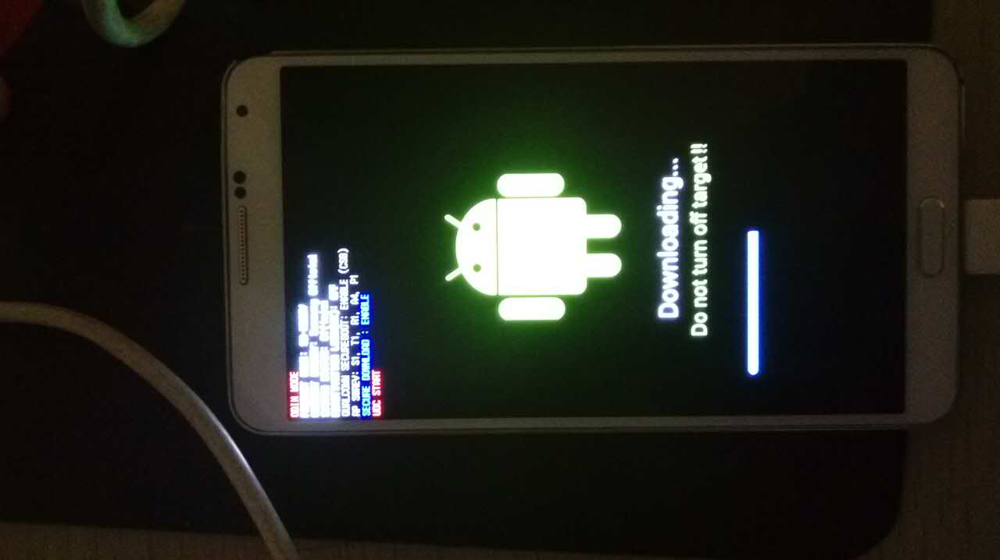

### SM-900V Note3升级5.1

### 升级步骤
1、备份手机通讯录、照片、视屏、app应用

手机通讯录通过360备份

照片视屏通过SmartFinder备份

APP备份软件(备份和回复)

2、进入挖煤模式双清信息

3、刷机步骤

软件列表

- [Odin](http://pan.baidu.com/s/1kUkvmXT)
- [ROM地址](http://pan.baidu.com/s/1numuaPb)
