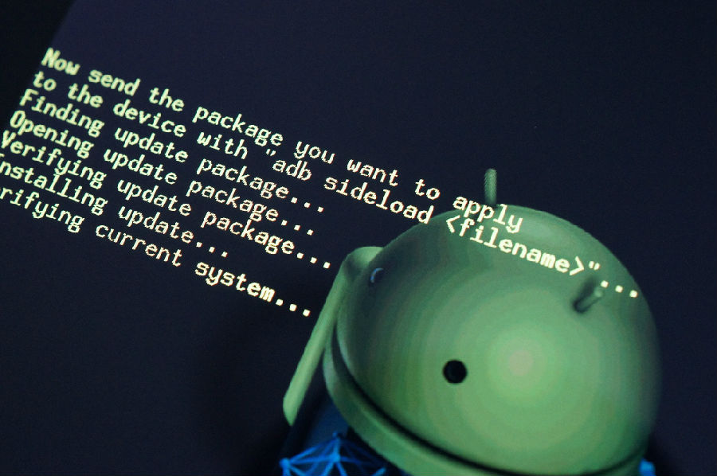
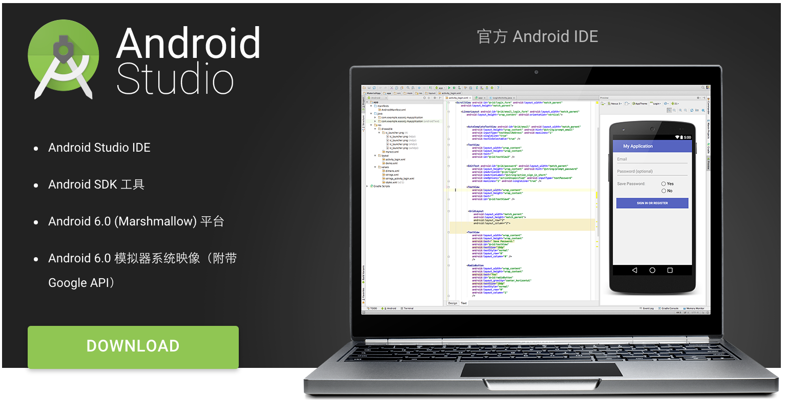
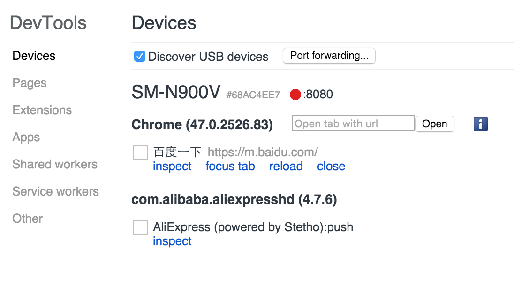
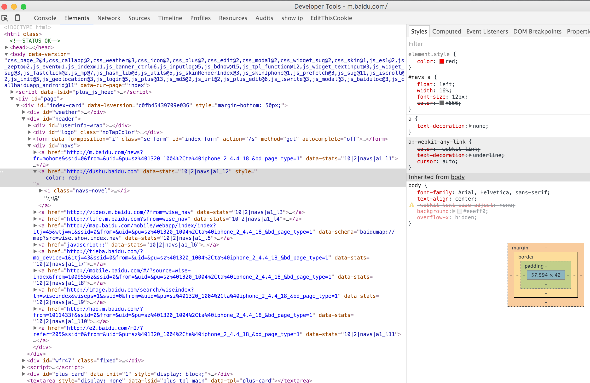
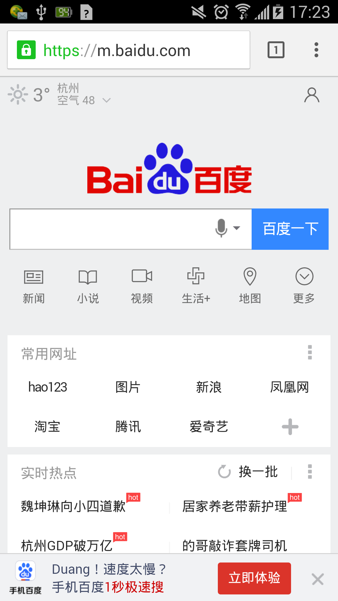

### MAC开发 Android USB 真机调试

> 需要Android版本>=4.4*，不满足的自己刷机可以参考上篇教程



### 真机调试需要 ADB 配置
    
> 什么是ADB?
> 客户端和服务器端交互的一个程序,你操作的电脑就是客户端,而android设备就是服务器端  
> 所以你的第一步需要在你的电脑安装 adb 客户端,这个客户端在sdk里包含了.因为我下的是 android strdio 里面自带sdk,当然也包括 adb 客户端 (没有sdk的先下载)



[Android 集成环境](http://developer.android.com/intl/zh-cn/sdk/index.html)

### 环境设置
> JDK 7.0以上

环境变量如下配置：

```
vi ~/.bash_profile

# java环境变量
export JAVA_HOME=/Library/Java/JavaVirtualMachines/jdk1.7.0_79.jdk/Contents/Home
# maven内存配置
export MAVEN_OPTS='-Xms256m -Xmx1024m'
# Android SDK配置
export ANDROID_HOME=/Users/yunyi/Library/Android/sdk
export PATH=$PATH:/usr/local/mysql/bin
# maven 路径配置
export PATH=$PATH:/Users/yunyi/maven-2.2.1/bin
# android 命令行配置
export PATH=$PATH:${ANDROID_HOME}/tools:${ANDROID_HOME}/platform-tools
# for color
export CLICOLOR=1
# \h:\W \u\$
export PS1='\[\033[01;33m\]\u@\h\[\033[01;31m\] \W\$\[\033[00m\] '
# grep
alias grep='grep --color=always'
# nvm快捷方式
source ~/.nvm/nvm.sh
```

### Chrome 真机调试







### 调试App 里面的WebView页面

> 通过代理工具可以直接连接手机进行app里面的内嵌WebView页面进行真机调试，支持debugger和JS断点调试，主要不要开模拟器不然速度很慢


