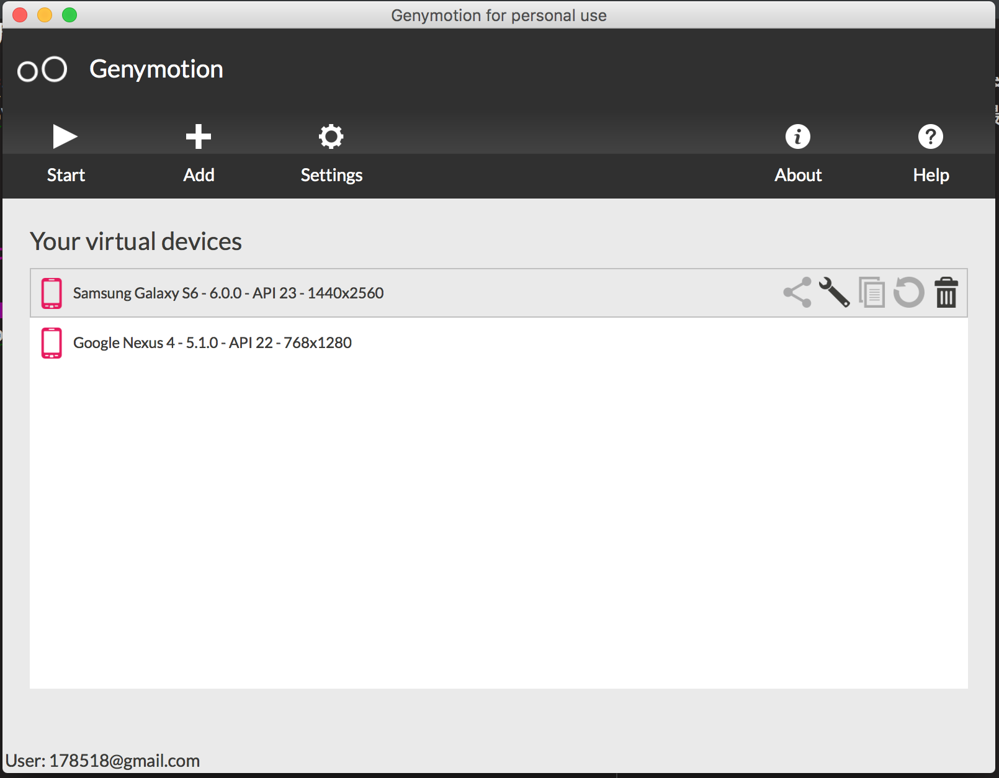
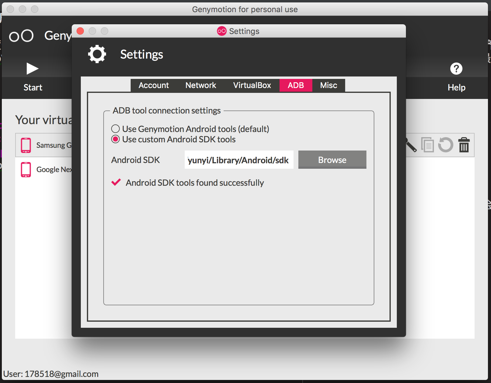
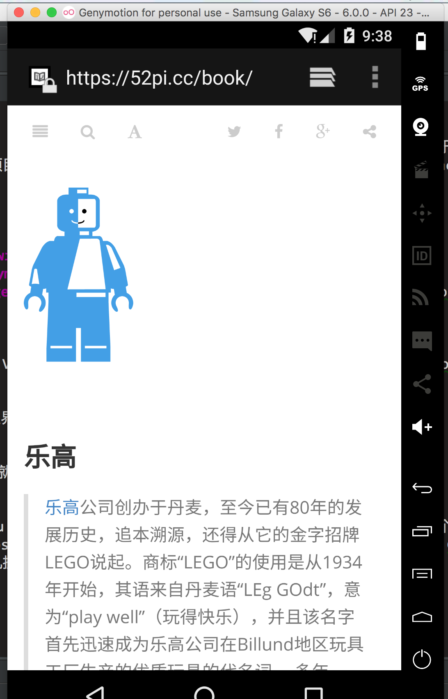
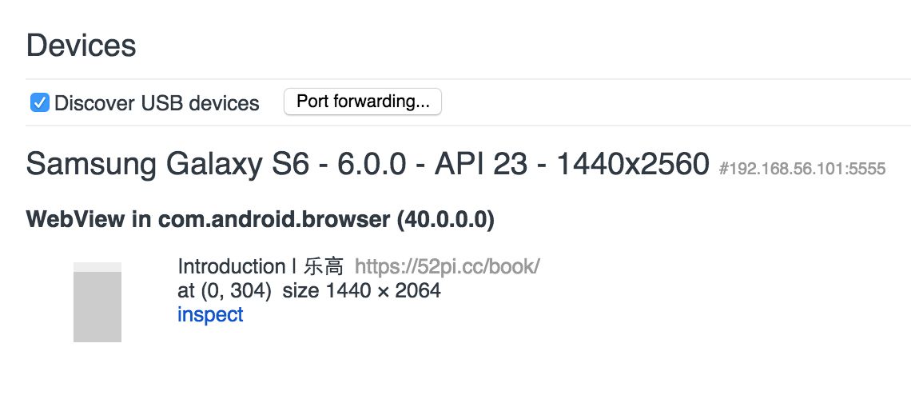

### MAC安装 Genymotion调试
Android 模拟器一直以速度奇慢无比著称，基本慢到不可用。本文介绍我一直在用的 Genymotion，速度不亚于真机。而且功能齐全，使用简单。
Genymotion 来自于 AndroVM 这个开源项目，基于 x86 和 VirtualBox，支持 OpenGL 加速，可以用于 Mac/Win/Linux。最近发布了新版，支持了 Android2.3/4.3，新增了拖拽安装 apk，移除了 Google 市场（后面提供解决方案）。另外增加了功能更丰富的付费版，个人可以继续使用免费版。

# 如何使用
简单介绍下如何获取和使用 Genymotion：

1.[下载](https://www.virtualbox.org/wiki/Downloads)并安装 VirtualBox；

2.注册[Genymotion](https://cloud.genymotion.com/page/customer/login/)帐号并登录；

3.根据自己的系统[下载](https://cloud.genymotion.com/page/launchpad/download/)并安装 Genymotion

然后就可以启动 Genymotion 程序了：
 

主界面的 Settings 按钮，可以用来设置 VirtualBox 及 ADB 路径等信息。点击 Add 按钮，用 Genymotion 帐号登录后，会显示可用的 Android 虚拟设备：
 

找到想要的机型和版本，装好之后，回到主界面点 Play 按钮启动它：
 
 

要安装应用，直接把 apk 文件拖进虚拟机就可以了：

键盘 esc 是虚拟机的后退键，f1 是 menu 键。可以看到虽然 Genymotion 底层使用 VirtualBox，但是整个过程中，VirtualBox 一直是幕后英雄，不会露面。
另外，如果安装了 Genymotion 的 Eclipse 插件，以后就可以在 Eclipse 里管理和使用虚拟机了。如果在 Genymotion 里指定了 ADB 路径，调试 Android 应用也很方便。
Genymotion 虚拟机运行于本机，所以本机拥有的内网权限，虚拟机也有。