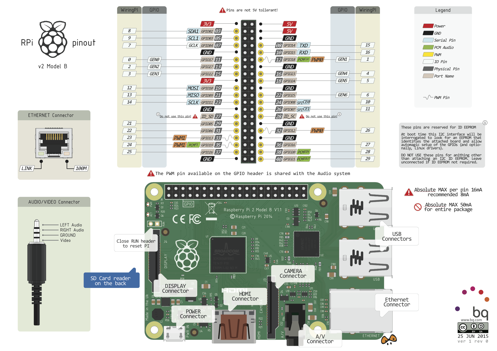
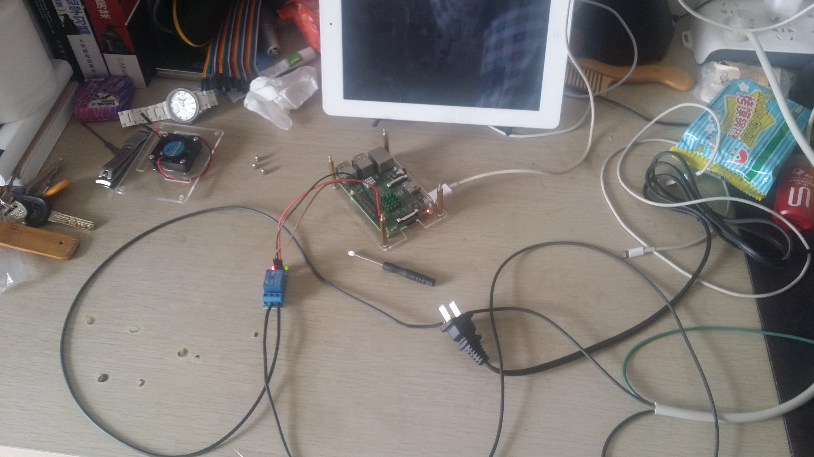

# 通过树莓派控制电灯开关

### 需要的材料

1.杜邦线

2.继电器

3.电灯

4.铜线若干

### GPIO说明



### 继电器说明


输入部分：

VCC:接5V电源正极（按继电器电压供电）

GND:接5V电源负极

IN: 继电器模组信号触发端（低电平触发有效）

高电平与低电平含义：

高电平触发指的是用VCC端的正极电压与触发端连接的一种触发方式，当触发端有正极电压或达到触发的电压时，继电器则吸合。

低电平触发指的是用GND端的负极电压与触发端连接的一种触发方式，当触发端有0V电压或电压低到可以触发时，继电器则吸合。

产品使用说明：

1.模组的供电：电源一定要直流，电压要与继电器的电压相符

2.继电器的公共端，常开，常闭，只是单刀双掷的开关，接线方法如下

常开端的接线方法：


当信号触发端有低电平触发时，公共端与常开端会接通，设备有电而工作

常闭端的接线方法：


当信号触发端有低电平触发时，公共端与常闭端会断开，设备无电不工作

### 电路图


### python 控制脚本
打开电灯
```
#!/usr/bin/env python
# encoding: utf-8

import RPi.GPIO as GPIO
import time

# 指定GPIO口的选定模式为GPIO引脚编号模式（而非主板编号模式）
GPIO.setmode(GPIO.BCM)

# 指定GPIO14（就是LED长针连接的GPIO针脚）的模式为输出模式
# 如果上面GPIO口的选定模式指定为主板模式的话，这里就应该指定8号而不是14号。
GPIO.setup(14, GPIO.OUT)

# 让GPIO14输出低电平（风扇启动）    
GPIO.output(14, False)

# 最后清理GPIO口,清理完毕后就没有电位了（不做也可以，建议每次程序结束时清理一下，好习惯）
#GPIO.cleanup()
```

关闭电灯
```
!/usr/bin/env python
# encoding: utf-8

import RPi.GPIO as GPIO
import time

# 指定GPIO口的选定模式为GPIO引脚编号模式（而非主板编号模式）
GPIO.setmode(GPIO.BCM)
GPIO.setwarnings(False)

# 指定GPIO14（就是LED长针连接的GPIO针脚）的模式为输出模式
# 如果上面GPIO口的选定模式指定为主板模式的话，这里就应该指定8号而不是14号。
GPIO.setup(14, GPIO.OUT)

# 让GPIO14输出低电平（风扇启动）    
#GPIO.cleanup()
GPIO.output(14, True)

# 最后清理GPIO口（不做也可以，建议每次程序结束时清理一下，好习惯）
GPIO.cleanup()
```

### 完整的效果图



后续可以通过node JS的pi-node GPIO写一个网页控制面板,就可以实现远程控制家用电器了