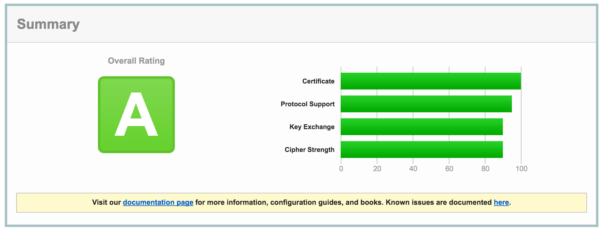

# nginx 开启HTTPS/HTTP2/SPYD/

# 首先确保机器上安装了openssl和openssl-devel

apt-get install openssl

apt-get install openssl-devel


# 然后就是自己颁发证书给自己

```
cd /home/pi
openssl genrsa -des3 -out server.key 1024
openssl req -new -key server.key -out server.csr
openssl rsa -in server.key -out server_nopwd.key
openssl x509 -req -days 365 -in server.csr -signkey server_nopwd.key -out server.crt
```

# 至此证书已经生成完毕，下面就是配置nginx

```
server {
    listen  443 ssl;
    #ssl on; 同时支持http和https
    ssl_certificate  /home/pi/server.crt;
    ssl_certificate_key  /home/pi/server_nopwd.key;
}
```

此方式下的证书是不受信任的,因为是自己颁给自己的,可以申请[沃通SSL](https://freessl.wosign.com/)

使用Chrome浏览器访问网页时遇到ERR_SPDY_INADEQUATE_TRANSPORT_SECURITY的错误，参考这里修改一下你的配置:

ssl_ciphers EECDH+CHACHA20:EECDH+AES128:RSA+AES128:EECDH+AES256:RSA+AES256:EECDH+3DES:RSA+3DES:!MD5;




[SSL&HTTP2检测](https://www.ssllabs.com/ssltest/index.html)

[legoHTTPS](https//www.yuuso.com)

[SPYD支持检查](https://spdycheck.org)

[HTTP2支持检查](https://tools.keycdn.com/http2-test)

[Tengine中开启HTTP/2](https://blog.yourtion.com/enable-http2-on-tengine.html)

[Tengine中开启HTTP/2协议支持](https://liuzhichao.com/2016/tengine-http2.html)

