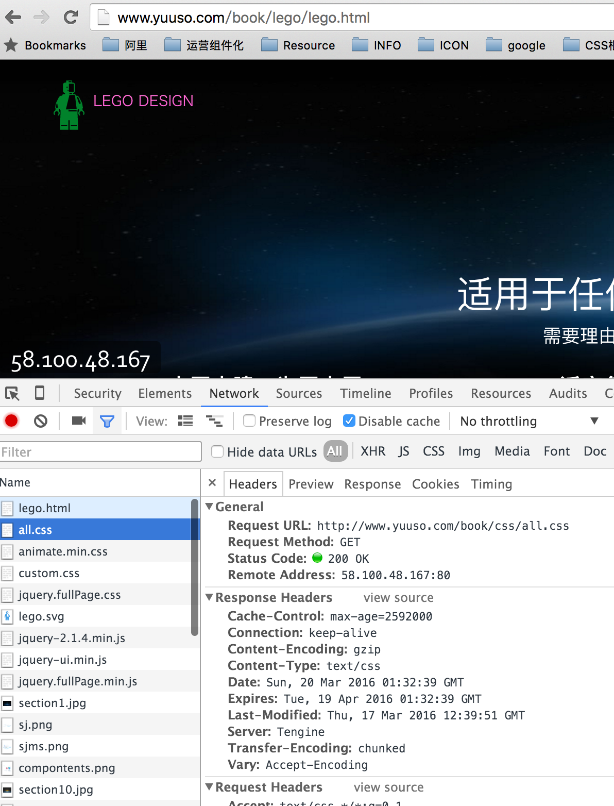
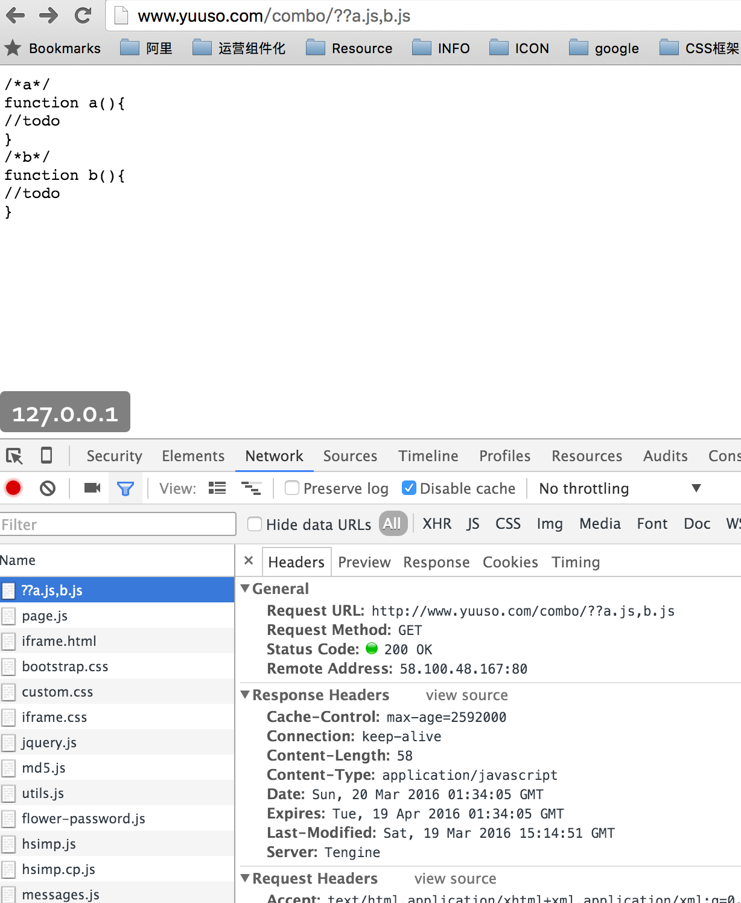

# tengine 安装

### 下载tengine

[Tengine](http://tengine.taobao.org/index_cn.html)

sudo wget -c http://tengine.taobao.org/download/tengine-2.1.2.tar.gz

### 安装必要的编译环境好

sudo apt-get install gcc autoconf automake

### 安装需要的组件

cd /usr/local/src

sudo wget -c ftp://ftp.csx.cam.ac.uk/pub/software/programming/pcre/pcre-8.37.tar.gz

sudo tar zxvf pcre-8.37.tar.gz

cd pcre-8.37

sudo ./configure --prefix=/usr/local/pcre

sudo make && make install

### 解压

sudo tar -xvf tengine-2.1.2.tar.gz

### 源码编译
sudo apt-get install gcc
sudo apt-get install libpcre3 libpcre3-dev
sudo apt-get install zlib1g zlib1g-dev
sudo apt-get install openssl libcurl4-openssl-dev

cd tengine-2.1.2
sudo ./configure --prefix=/opt/webserver/tengine --with-http_concat_module --with-http_headers_module
sudo make && make install

### 替换原有的nginx

sudo cp nginx /usr/sbin/

### 确认替换成功

nginx -v

Tengine version: Tengine/2.1.2 (nginx/1.6.2)

### 开启combo功能和expires_by_types

location / {
            #root   /var/www/html;
            #index  index.html index.htm index.php;
                # 禁用缓存
                proxy_buffering off;
                # 打开concat 功能
                # 默认关闭
                concat on;
                # 最大合并文件数 (默认: 10)
                concat_max_files 20;
                # 只允许同类型文件合并 默认是开启的
                concat_unique on;
                # 允许合并的文件类型，多个以逗号分隔。如：application/x-javascript, text/css
                concat_types application/javascript text/css;
                #支持根据Content-Type来设置过期时间
                expires_by_types       30d text/css;
                expires_by_types       30d application/javascript;
        }
        
        

        

        

        
