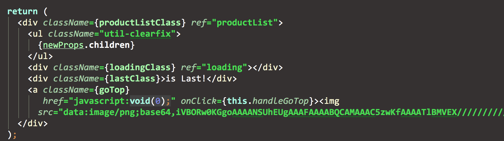
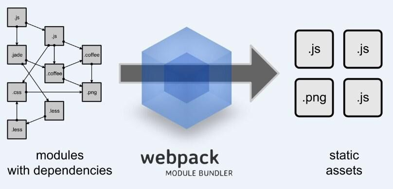
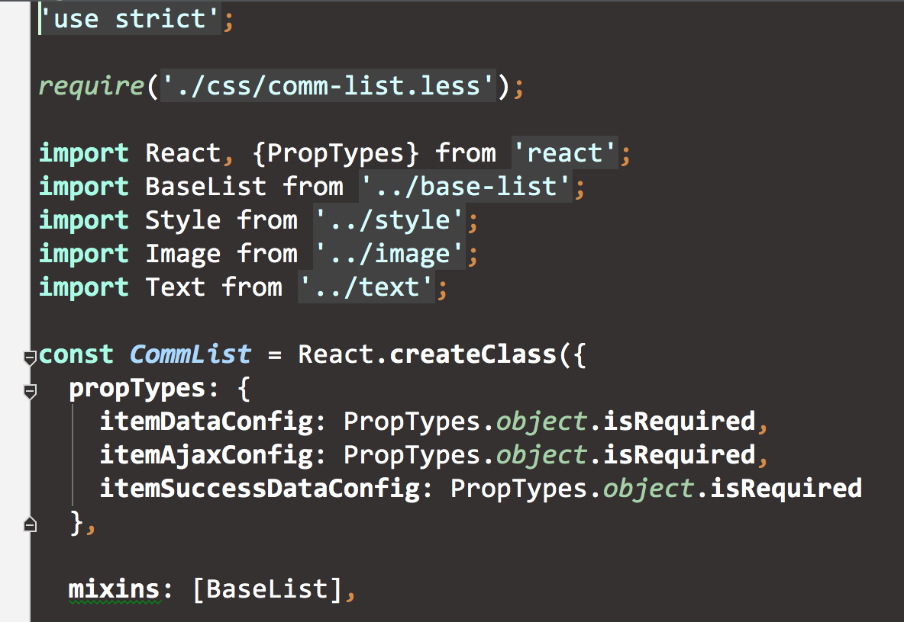

# 组件化实践

### WebComponents 标准

传统jQuery组件化使用所需要的步奏：

> 1、引入插件js

> 2、引入插件所需的css（如果有）

> 3、copy 组件的所需的html片段

> 4、添加代码触发组件启动

现阶段的"组件"基本上只能达到是某个功能单元上的集合。他的资源都是松散地分散在三种资源文件中，尤其是CSS文件对于组件调用者来说是黑盒。

WebCompoents的四部分功能：

> 1、template定义组件的HTML模板能力

> 2、Shadow Dom封装组件的内部结构，并且保持其独立性

> 3、Custom Element 对外提供组件的标签，实现自定义标签

>4、import解决组件结合和依赖加载

### 组件化实践方案

官方的标准看完了，我们思考一下。一份真正成熟可靠的组件化方案，需要具备的能力。

> “资源高内聚”—— 组件资源内部高内聚，组件资源由自身加载控制，组件使用者无需关注内部细节

> “作用域独立”—— 内部结构密封，不与全局或其他组件产生影响 

> “自定义标签”—— 定义组件的使用方式，

> “可相互组合”—— 组件正在强大的地方，组件间组装整合

> “数据配置化”—— 基于元数据、PATH解析器来实现数据差异化和组件的分离，保持组件层的数据模型的独立性和稳定性

> “接口规范化”—— 组件接口有统一规范，或者是生命周期的管理

> “可插拔无指令污染”—— 这个不是组件化的范畴，但是作为一个解决方案应尽可能的减小对于使用方的侵入，前端的编译、打包、合并应全部是线下解决，线上就是一个静态托管环境，避免各种指令对第三方的污染。

个人认为，模板能力是基础能力，跟是否组件化没有强联系，所以没有提出一个大点。

### JSX很丑，但是组件内聚的关键

技术方案【Webpack】+【React】将会是这套方案的核心技术。

学习完React这个组件化框架后，看看组件化能力点的完成情况



> “资源高内聚”—— (33%) html与js内聚

> “作用域独立”—— (50%) js的作用域独立

> “自定义标签”—— (100%) jsx

> “可相互组合”—— (50%)  可组合，但缺乏有效的加载方式

> “数据配置化”—— (100%) props 

> “接口规范化”—— (100%) 组件生命周期方法

> “可插拔无指令污染”—— (100%) 非指令方式，基于虚拟DOM解决污染问题

### Webpack 资源组件化

对于组件化的资源独立性，一般的模块加载工具和构建流程视乎变得吃力。组件化的构建工程化，不再是之前我们常见的，css合二，js合三，而是体验在组件间的依赖于加载关系。webpack正好符合需求点，一方面填补组件化能力点，另一方帮助我们完善组件化的整体构建环境。
 
首先要申明一点是，webpack是一个模块加载打包工具，用于管理你的模块资源依赖打包问题。这跟我们熟悉的requirejs模块加载工具，和grunt/gulp构建工具的概念，多多少少有些出入又有些雷同。





### 组件一体输出

如果说，react使到html和js合为一体。
那么加上webpack，两者结合一起的话。js，css，png(base64)，html 所有web资源都能合成一个JS文件。
这正是这套方案的核心所在：组件独立一体化。如果要引用一个组件，仅仅require('./comm-list.js') 即可完成。
 
加入webpack的模块加载器之后，我们组件的加载问题，内聚问题也都成功地解决掉

> “资源高内聚”—— (100%) 所有资源可以一js输出

> “可相互组合”—— (100%) 可组合可依赖加载

### 组件化之路还在继续
配搭gulp补充webpack构建能力，webpack的react-hotloader神器。热加载的开发模式绝对是下一代前端开发必备。
严格说，如果没有了热加载，我会很果断地放弃这套方案，即使这套方案再怎么优秀，我都讨厌react需要5~6s的编译时间。
但是hotloader可以在我不刷新页面的情况下，动态修改代码，而且不单单是样式，连逻辑也是即时生效。
最终经过测试的模块统一被推送到npm上，使用者类似Java的二方库的方式引入使用，解决了开发更新问题。

```
    "start": "node-dev app",
    "production": "NODE_ENV=prduction node app",
    "build": "gulp",
    "lint":"npm run eslint",
    "eslint": "eslint src/js/components --ext '.js,.jsx'",
    "prepublish": "rm -rf lib && npm run lint && babel src/js/components --out-dir lib && rm -rf lib/style && node scripts/prenpm.js",
    "postpub":"npm run prepublish && cd lib && npm publish"
```


如上在form表单内。使用热加载，表单不需要重新填写，修改submit的逻辑立刻生效。这样的开发效率真不是提高仅仅一个档次。
