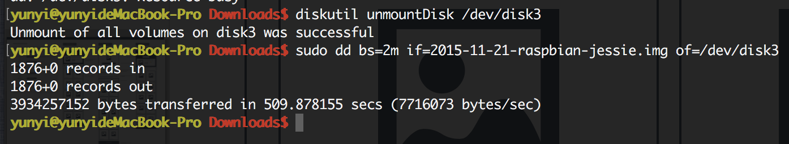

#MacOS 烧录树莓派

### 查看磁盘挂载情况
[XBian下载](http://download.xbian.org/release/XBian_2016.02.06_rpi.img.gz)
```
diskutil list
```


### 卸载挂载盘
烧录前要卸载挂载，不然无法进行

```
diskutil unmountDisk /dev/disk2
```


### 生成镜像，相当于备份
```
sudo dd bs=4m if=/dev/disk2 of=backup.img

利用gzip进行压缩备份
sudo dd bs=4m if=/dev/disk2 | gzip > backup.gz

将压缩的备份文件恢复到指定盘

sudo gzip -dc backup.gz | dd of=/dev/disk2
```

### 开始烧录
烧录前要卸载挂载，不然无法进行

```
sudo dd bs=4m if=XBian_2016.02.06_rpi.img of=/dev/disk2
```


開始將映像檔燒錄到 SD 卡。其中的「if」，是「Input File」的縮寫。「of」是「Output File」的縮寫。「bs」是「Block Size」的縮寫。

等待一會兒，您的 SD 卡燒錄完畢，就可以直接使用了。这个过程比较久一定要耐心等待。

### 浅析linux下的bash命令

配置可能存在的位置：/etc/profile、/etc/bashrc、~/.bash_profile、~/.bashrc文件

1、/etc/profile 

全局（公有）配置，不管是哪个用户，登录时都会读取该文件。 

2、~/.bash_profile  
只有bash是以login形式执行时，才会读取此文件。通常该配置文件还会配置成去读取~/.bashrc。

sudo nano .profile

环境变量不能配错，不然会造成无法发送pi的信息

PATH=$PATH:/usr/local/sbin:/usr/sbin:/sbin
 
立即生效需要执行：source ~/.profile

终端中再次输入命令：echo $PATH
 
3、提示命令不存在的解决方法

如果新装的系统，运行一些很正常的诸如：shutdown，fdisk的命令时，悍然提示：bash:command not found。那么
首先就要考虑root 的$PATH里是否已经包含了这些环境变量。
主要是这四个：/bin ,/usr/bin,/sbin,/usr/sbin。

四个主要存放的东东：

./bin: 

bin为binary的简写主要放置一些系统的必备执行档例如:cat、cp、chmod df、dmesg、gzip、kill、ls、mkdir、more、mount、rm、su、tar等。 

/usr/bin: 

主要放置一些应用软体工具的必备执行档例如c++、g++、gcc、chdrv、diff、dig、du、eject、elm、free、gnome*、 gzip、htpasswd、kfm、ktop、last、less、locale、m4、make、man、mcopy、ncftp、 newaliases、nslookup passwd、quota、smb*、wget等。 
  
/sbin: 

主要放置一些系统管理的必备程式例如:cfdisk、dhcpcd、dump、e2fsck、fdisk、halt、ifconfig、ifup、 ifdown、init、insmod、lilo、lsmod、mke2fs、modprobe、quotacheck、reboot、rmmod、 runlevel、shutdown等。 
  
/usr/sbin: 

放置一些网路管理的必备程式例如:dhcpd、httpd、imap、in.*d、inetd、lpd、named、netconfig、nmbd、samba、sendmail、squid、swap、tcpd、tcpdump等。

可以在~目录下查看.bash_profile里的PATH。如果是：PATH=$PATH:$HOME/bin则需要添加成如下：

4、Mac 启动加载文件位置

1.首先要知道你使用的Mac OS X是什么样的Shell，

使用命令

echo $SHELL

如果输出的是：csh或者是tcsh，那么你用的就是C Shell。

如果输出的是：bash，sh，zsh，那么你的用的可能就是Bourne Shell的一个变种。

Mac OS X 10.2之前默认的是C Shell。

Mac OS X 10.3之后默认的是Bourne Shell。
 
2.如果是Bourne Shell。

那么你可以把你要添加的环境变量添加到你主目录下面的.profile或者.bash_profile，如果存在没有关系添加进去即可，如果没有生成一个。
 
5、Mac配置环境变量的地方

1./etc/profile 建议不修改这个文件 ）

全局（公有）配置，不管是哪个用户，登录时都会读取该文件。
 
2./etc/bashrc 一般在这个文件中添加系统级环境变量）

全局（公有）配置，bash shell执行时，不管是何种方式，都会读取此文件。
 
3.~/.bash_profile （一般在这个文件中添加用户级环境变量）

每个用户都可使用该文件输入专用于自己使用的shell信息,当用户登录时,该文件仅仅执行一次

4.查看PATH环境变量

echo $PATH

5.mac PATH全局配置

nano /etc/paths
 