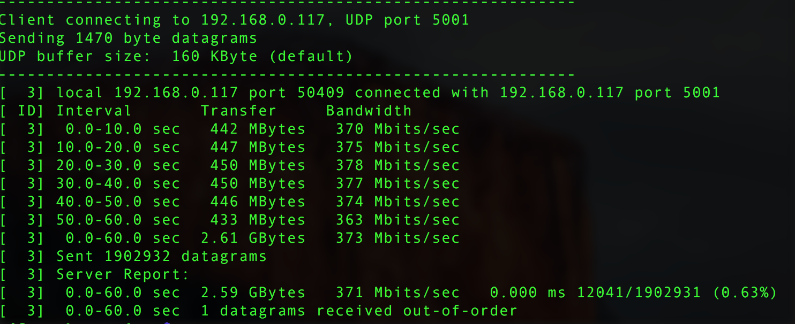

# iperf命令行工具进行局域网测速

### mac安装iperf

brew install iperf

### 启动iperf

iperf命令行的参数可以iperf -help查看，我就不细说了，主要说一下常用的。

iperf分为server和client，支持TCP测速和UDP测速，个人建议局域网使用UDP测速会比较准确，对于丢包率和延迟都能反映的比较明显，而TCP由于重传机制，真实的带宽会不准。

服务端监听UDP命令： iperf -s -u

客户端使用UDP测试命令：iperf -u -c 服务端IP -b 1000M -t 60 -i 10

介绍一下参数：

-s server

-c client + server IP

-u udp

-b bandwidth，这个是用来表示使用多大带宽进行发包，根据真实环境进行调整

-t time，发包多长时间，单位是秒

-i interval，结果输出间隔时间，如果不加这个参数，那么就等到全部测试完成才给结果

Mbps即“传输速率”，也叫“带宽”。去营业厅开网线的时候会问开几兆的宽带，这里说的“几兆的宽带”就是指多少Mbps，但是Mbps和MB/s是怎么换算的呢？

理论上：8Mbps换算成下载速度就是1MB/s，不过由于种种限制，实际情况中8M的宽带往往达不到1MB/s的下载速度，能达到800KB/s以上算是正常情况。

延伸阅读：

1 Mbps代表每秒传输1,000,000位，即每秒传输1,000,000/8=125,000字节=125KB=0.125MB。

其中：

bit代表位，存放一位二进制数，即 0 或 1，最小的存储单位

Byte代表字节，8个二进制位为一个字节，即1Byte=8bit，Byte为数据量常用单位

注意：

字母大小写的区别，小写b代表bit，大写B代表Byte，不能混用；Mbps缩写中严格限定M为大写，b、p、s为小写

常用单位还有Kbps 、Mbps 、Gbps（同样K、M、G严格限定为大写）

Mbps（Mb/s）的含义是兆比特每秒，指每秒传输的位数量（小写b代表bit）

MB/s的含义是兆字节每秒，指每秒传输的字节数量（大写B代表Byte）

1Mbps（Mb/s）=1024*1024bit=1024*1024/8Byte=1024/8KB=128KB=1/8MB=0.125MB

即8Mbps=1MB/s

IEC标准规定如下

1Byte=8bit

1 KB = 1,024 Bytes

1 MB = 1,024 KB= 1,048,576 Bytes

1 GB = 1,024 MB= 1,048,576 KB= 1,073,741,824 Bytes

1 TB = 1,024 GB= 1,048,576 MB= 1,073,741,824 KB= 1,099,511,627,776 Bytes

### 资料文献

- [使用iperf命令行工具进行局域网测速](https://www.slyar.com/blog/iperf-measure-network-performance.html)
- [linux网络性能测试工具Iperf使用介绍](http://ponyjia.blog.51cto.com/917324/830800)