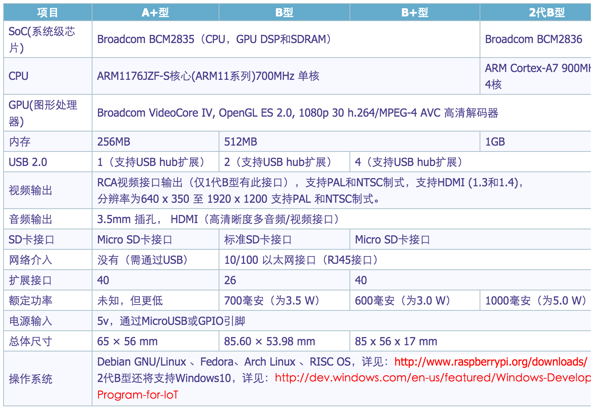

### 树莓派

[树莓派](http://baike.baidu.com/link?url=kkrg7HIXSJRU_SQ_M6yH5pp_sI8yG0dxXEqwx4OVSzdM4m2KZk8AS9ulXLbQbPDYX4g0bVlgEfKGXT6W9jKxb2dz38iT_eXJ2CEnYgOPYKK)(为学生计算机编程教育设计的一种卡片式电脑)
Raspberry Pi(中文名为“树莓派”,简写为RPi，(或者RasPi / RPI)是为学生计算机编程教育而设计，只有信用卡大小的卡片式电脑，其系统基于Linux。
随着Windows 10 IoT的发布，我们也将可以用上运行Windows的树莓派。
自问世以来，受众多计算机发烧友和创客的追捧，曾经一“派”难求。别看其外表“娇小”，内“心”却很强大，视频、音频等功能通通皆有，可谓是“麻雀虽小，五脏俱全”。

Raspberry Pi（树莓派）是一款只有信用卡大小、使用基于 Debian 系统的微型电脑，它内置多种接口，包括视频、USB、LAN 等，你很容易就可以以非常少的价格拼装出一台可用的微型计算机。

> 一句话：树莓派是一个卡片大小的开发板，上面可以运行Linux系统，我们可以用它开发我想要的设备。

### 树莓派的种类
> A型：1个USB、无有线网络接口、功率2.5W,500mA、256MB RAM（基本已经见不到了）

> B型：2个USB、支持有线网络、功率3.5W，700mA、512MB RAM、26个GPIO(市售还有很多)。

> B+型：4个USB口、支持有线网络，功耗1W，512M RAM 40个GPIO（2014新出的，我用的就是B+）

> 购买请在淘宝上搜一下，非常多：200到--300元之间（裸板，不含SD卡、电源）

### 树莓派参数

### Raspberry Pi 上的接口

准确地说，它是一款基于 ARM 的电脑主板，以 SD 卡做启动、储存磁盘。购买 Rasberry Pi 之后，你还需一个 2G 以上的 SD 卡，将系统安装进去，具体安装[方法见此](http://www.cnblogs.com/abel/p/3441175.html)

这些只是基本应用，如果你想拿它多做些有趣的事儿，不妨看看《[各种对 Raspberry Pi 的有趣改造、扩展应用有哪些？](http://www.zhihu.com/question/20697024)》。